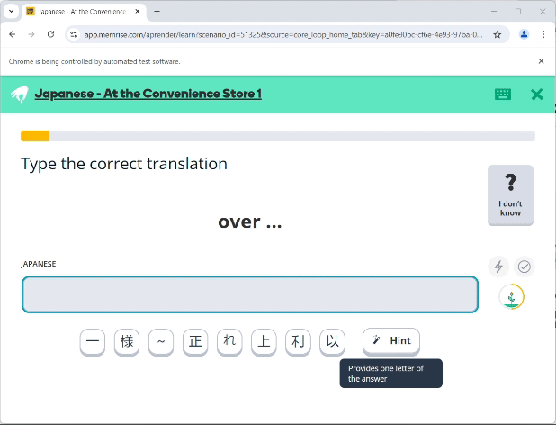
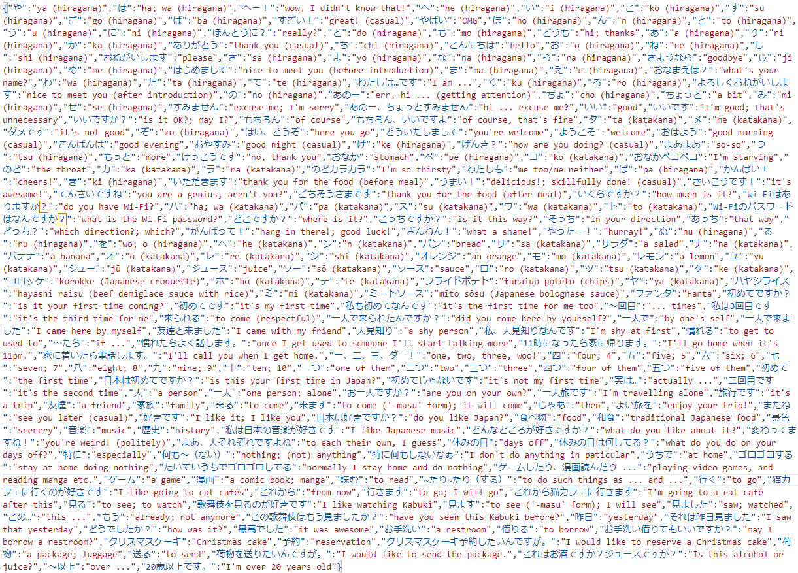
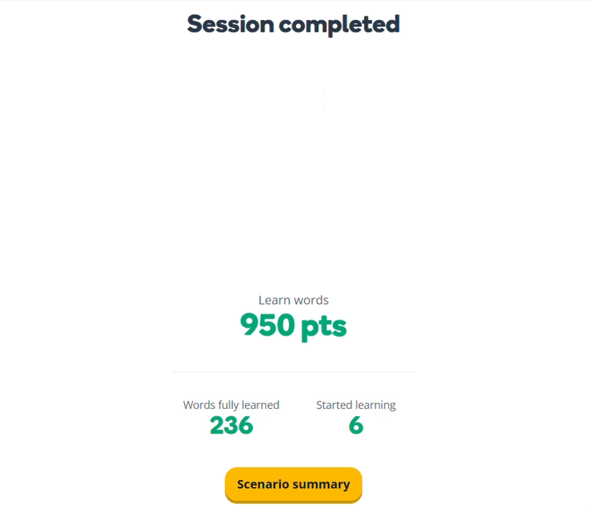

# Memrise Bot
***A web-crawler made to earn you points in Memrise***

[Built With](#built-with) · [Features](#features) · [Installation](#installation) · [Usage](#usage)

## Built With
- 
- 
- 

## Features

### Automated Web Crawling
I used Selenium to control a Chrome session with pre-recorded CSS selectors.



### Safety Redundancies
I've implemented several layers of redundancy to catch pseudo-pop-up pages that interfer with the crawler. Unfortunately, any new "pop-ups" might hault this program in the future as the website updates its UI/X.

### Long-Term Memory
All words and phrases learned throughout the session are recorded locally at ```./data/translations.json``` for future use.



## Installation
1. Install a C# compiler.
    > I recommend using .NET [with VS Code](https://code.visualstudio.com/docs/languages/csharp)

2. Clone the repository
    ```sh
    git clone https://github.com/tadahiroueta/memrise-bot.git
    ```

3. Install dependencies
    ```sh
    dotnet restore
    ```

4. Build the project
    ```sh
    dotnet build
    ```

5. Get your cookies
    - Sign in/up to [Memrise](https://www.memrise.com/)
    - Download cookies as ```app.memrise.com.cookies.json``` in the ```data/``` folder
        > I recommend using [this Chrome extension](https://chrome.google.com/webstore/detail/%E3%82%AF%E3%83%83%E3%82%AD%E3%83%BCjson%E3%83%95%E3%82%A1%E3%82%A4%E3%83%AB%E5%87%BA%E5%8A%9B-for-puppet/nmckokihipjgplolmcmjakknndddifde?hl=en)

6. Additional settings
    - Go to "Learning Settings" in Memrise
    - (Optionally) set all "Words and phrases per session" to the max amount
    - Turn off "Jumbled word tests"
    - Turn on "Disable audio

## Usage
1. Run the program
    ```sh
    dotnet run
    ```

    > You should see a Chrome window open and login to your Memrise dashboard.

2. Enter the number of points you want in the console, and let the crawler do its thing.
  
    
